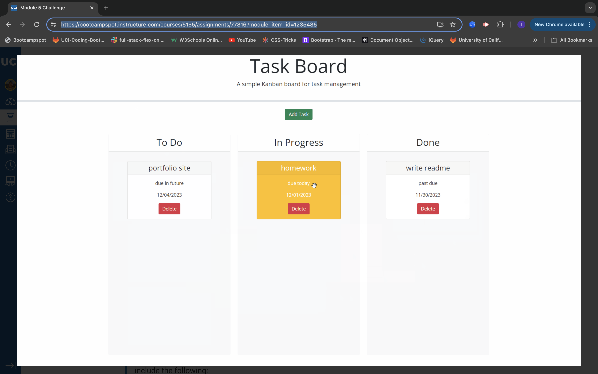

# Task-Board

## Description

As a project team member with multiple tasks to organize I want a task board I can add individual project tasks, manage their state of progress and track overall project progress accordingly.

## Installation

N/A

## ScreenShot

## Link

[Link](#https://github.com/alextran1985/Task-Broad)

## License

The last section of a high-quality README file is the license. This lets other developers know what they can and cannot do with your project. If you need help choosing a license, refer to [https://choosealicense.com/](https://choosealicense.com/).

---

